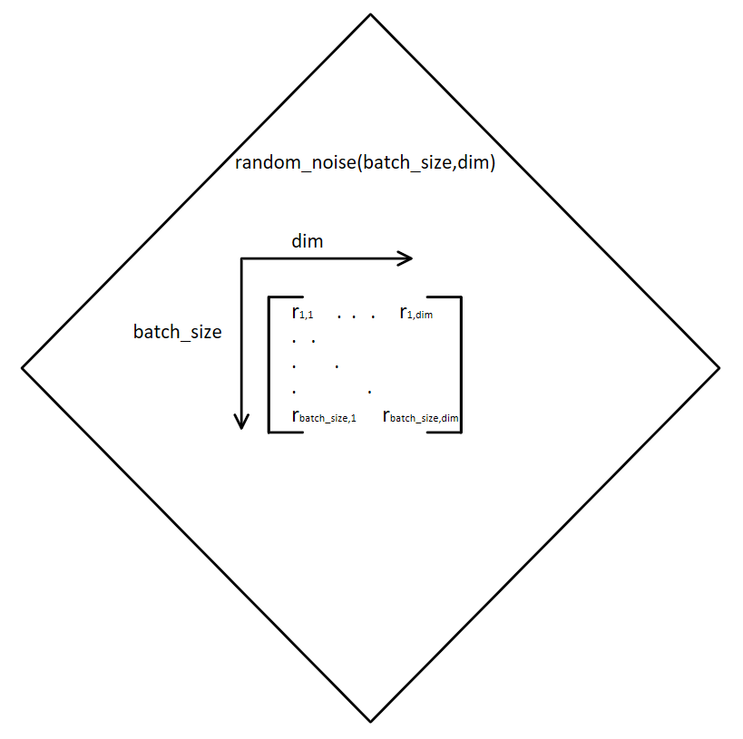

# Vanila-GAN
Teamproject GAN Group 1.
Team members: Julien, Hakan, Dennis, Delight

# Documentation<br />
#### 21.05.2020<br />
We created a Whatsapp Group and a Discord sever to be better in contact with each of us.<br />

#### 25.05.2020<br />
Over the weekend, we created a text-channel on our Discord server "websites-and-links" where we collected some useful links and explanations about our project.<br />
The Monday later we had our first meeting over Discord. We created the repository and the project "vanila-gan" and tried to get used to github.<br />
Results from the first Meeting:<br />
	- created the project<br />
	- Implemented during the meeting the "random_noise(dim,batch_size)" and the "data_loader" function<br />
	- Distribution of tasks:<br />
		- Discriminator research & implementation Hakan and Julien<br />
		- Generator research & implementation Delight and Dennis<br />
		- created a new experimental branch<br />

#### 26.05.2020 - 30.05.2020 <br />
---research time---<br />

#### 31.05.2020<br />
Later this week we had our second meeting, where we presented and explained our tasks to the other duo.<br />
We put an sturcture for the Generator and the Discriminator in the experimental branch.<br />
Results from the second Meeting:<br />
	- updated and adjusted the discriminator/generator layout <br />
	- added the train function<br />

#### 03.06.2020<br />
Results from the third Meeting:<br />
	- added the optim.Adam() optimizers in the experimental branch<br />

#### 10.06.2020<br />
We faced during the Meeting some size-mismatch problems which we tried to remedy for the rest of the day.<br />
Results from the fourth Meeting:<br />
	- updated the "data_loader" function<br />
	- added the converter functions img_to_vec and vec_to_img in the experimental branch<br />
	- added code for importing the logger from 'Google Drive'<br />
	- got our first visual outputs<br />

#### 11.06.2020 - now<br />
After we had some good results without any errors in our experimental branch we started impelmenting parts of the code in our master Branch.<br />
We added some variables for functions and numbers for better visualization.<br />


## Tutorial on how to run the GAN<br />

1. Go on Colab using the following link 'https://colab.research.google.com/notebooks/welcome.ipynb'.<br />
2. Press on the 'File/Open Notebook'. You can also use the hotkeys 'STRG+O'.<br />
3. Press GitHub on the upper bar and wait for colab to authorize with your GitHub account.<br />
4. Now you choose 'HakanDeymeci/vanila-gan' as Repository and 'master' as Branch.<br />
5. Now open the python notebook data called 'Generative_Adversarial_Networks_PyTorch.ipynb'.<br />
6. Importing the Logger file from Drive:<br />
6.1. Go on the following link 'https://github.com/HakanDeymeci/vanila-gan/blob/master/utils.py' and<br />
download this file.<br />
6.2. Add this file to Drive over the link 'https://drive.google.com/drive/my-drive'.<br />
6.3. Press hotkeys 'STRG+F9' and run the code for the first time.<br />
6.4. Press on the link below the first code snippet to get authorization code.<br />
6.5. Copy this code and insert it in the field and press enter.<br />
6.6. Now tensorboardX-2.0 should be installed successfully.<br />
7. To run the GAN press now the hotkeys 'STRG+F9' oder go under 'Run all' over the dropdown menu
'Runtime'.<br />

## Overview of the Vanila GAN
The Vanila GAN is a Generative Adversarial Network. The main parts are a Discriminator, a Generator and a dataset. In our case the MNIST dataset that holds images of handwritten numbers. The main goal of the GAN is that the Generator should produce fake images that can’t be differentiated with real images by the Discriminator. In other words: The Generator should make the Discriminator think that it is always getting real images even if they are generated.
We visualized the GAN in the following picture. 


# Explanation of our Code

We start by mounting a Google Drive since we run our code in Google Colab and need to have our logger and GAN in separate files but in the same folder.

```
from google.colab import drive
drive.mount('/content/drive')

import sys
sys.path.append('/content/drive/My Drive/Colab Notebooks')

!pip3 install tensorboardX
```

Next we need to import these dependencies.

```
import torch
import torch.nn as nn
import torch.optim as optim
from torch.autograd.variable import Variable
from torchvision import transforms
from torchvision.datasets import MNIST
from torchvision.utils import make_grid
from torch.utils.data import DataLoader
import imageio
```

We also need a logger to log the process of our GAN so we imported a logger from a separate file as Logger. This file has to be in the same folder as the GAN itself.

```
from utils import Logger
```

## Dataset
We are using the MNIST dataset that includes black and white images of handwritten digits that are sized 28x28.
Since the input values of the dataset are between 0 and 255 we need to normalize them in to values between -1 and 1.

```
batch_size = 56
transform_data = transforms.Compose([transforms.ToTensor(), transforms.Normalize(mean=[0.5], std=[0.5])])

mnist_data = MNIST(root='./MNIST_data', train=True, download=True, transform=transform_data) 
data_loader = DataLoader(dataset=mnist_data, shuffle=True, batch_size=batch_size)
```

## Networks
Before defining the networks we have to create some random noise. random_noise(batch_size,dim) generates a Tensor/Matrix with numbers between -1 an 1.


```
def sample_noise(batch_size, dim): 
    return torch.rand(batch_size, dim) + torch.rand(batch_size, dim)*(-1)
```
### Visualization of the sample_noise(batch_size, dim)



Moving on we will define the Networks. We are using a Discriminator and Generator. These two networks are built with a three hidden-layer neural network.
Starting with the Discriminator that takes flattened images (28x28 = 784) as input and returns the probability if the input might be a real- or a generated fake image. The Discriminators goal is to distinguish whether input images are real or generated by the Generator. 
Each hidden layer is followed by a LeakyRelu and a Dropout function. The Sigmoid function is used in our output to keep values in the range of (0,1).

```
class DiscriminatorNet(torch.nn.Module):

    def __init__(self):
        super(DiscriminatorNet, self).__init__()
        input_size = 784 #28x28
        DfirstHiddenLayer_size = 1024
        DsecondHiddenLayer_size = 512
        DthirdHiddenLayer_size = 256
        
        output_size = 1
        
        self.firstHiddenLayer = nn.Sequential( 
            nn.Linear(input_size, DfirstHiddenLayer_size),
            nn.LeakyReLU(0.2),
            nn.Dropout(0.3)
        )
        self.secondHiddenLayer = nn.Sequential(
            nn.Linear(DfirstHiddenLayer_size, DsecondHiddenLayer_size),
            nn.LeakyReLU(0.2),
            nn.Dropout(0.3)
        )
        self.thirdHiddenLayer = nn.Sequential(
            nn.Linear(DsecondHiddenLayer_size, DthirdHiddenLayer_size),
            nn.LeakyReLU(0.2),
            nn.Dropout(0.3)
        )
        self.outputLayer = nn.Sequential(
            torch.nn.Linear(DthirdHiddenLayer_size, output_size),
            torch.nn.Sigmoid()
        )

    def forward(self, x):
        x = self.firstHiddenLayer(x)
        x = self.secondHiddenLayer(x)
        x = self.thirdHiddenLayer(x)
        x = self.outputLayer(x)
        return x
    
discriminator = DiscriminatorNet()
```
### Visualization of the DiscriminatorNet()


Furthermore we added one function that converts flattened images into a 2D representation. We also added a function that does it vice versa. 

```
def images_to_vectors(images):
    return images.view(images.size(0), 784)

def vectors_to_images(vectors):
    return vectors.view(vectors.size(0), 1, 28, 28)
```

Moving on we defined the Generator Network that is also built with a three hidden layer neural network. The Generators goal is to learn how to create fake images that are not distinguishable of real images that the MNIST dataset provides by the Discriminator.
The structure of the Generator is similar to the structure of the Discriminator. The net will have three hidden layers that are followed by a LeakyRelu. Tanh is the activation function that maps results into range (-1, 1) in the output layer.

```
class GeneratorNet(torch.nn.Module):

    def __init__(self):
        super(GeneratorNet, self).__init__()
        n_features = 256 #not sure what the correct value would be, is this how many photos we have?
        n_out = 784 #I think 784 is correct? 
        GfirstHiddenLayer_size = 256
        GsecondHiddenLayer_size = 512
        GthirdHiddenLayer_size = 1024
        
        #all values will probably have to be replaced, I don't know how to check if this is correct
        self.hidden0 = nn.Sequential(
            nn.Linear(n_features, GfirstHiddenLayer_size), 
            nn.LeakyReLU(0.2)
        )
        self.hidden1 = nn.Sequential(            
            nn.Linear(GfirstHiddenLayer_size, GsecondHiddenLayer_size), 
            nn.LeakyReLU(0.2)
        )
        self.hidden2 = nn.Sequential(
            nn.Linear(GsecondHiddenLayer_size, GfirstHiddenLayer_size), 
            nn.LeakyReLU(0.2)
        )
        
        self.out = nn.Sequential(
            nn.Linear(GfirstHiddenLayer_size, n_out),
            nn.Tanh()
        )

    def forward(self, x):
        x = self.hidden0(x)
        x = self.hidden1(x)
        x = self.hidden2(x)
        x = self.out(x)
        return x
    
generator = GeneratorNet()
```
### Visualization of the GeneratorNet()


## Optimization
Another point to consider is the optimization algorithm for both of our networks. We are using a function that returns a Adam optimization. The learning rate we have chosen is the result of intense testing.

```
Discriminator_lr = 0.0002
Generator_lr = 0.0002
Discriminator_Optimizer = optim.Adam(discriminator.parameters(), lr=Discriminator_lr) 
Generator_Optimizer = optim.Adam(generator.parameters(), lr=Generator_lr)
```

Next we defined the loss function with a Binary Cross Entopy Loss that is used to calculate the loss of each mini batch.

```
loss = nn.BCELoss()
```
## Training a GAN
### Real and fake images
We can assume that real images are always ones while fake images are always zeros so we have to define two functions that return these values.

```
def real_data_target(size):
    data = Variable(torch.ones(size, 1))
    return data

def fake_data_target(size):
    data = Variable(torch.zeros(size, 1))
    return data
```
    
### Discriminator Loss & Generator Loss


This is a visualization of the loss values according to the first 50 epochs of a run of our GAN.<br />
It can be seen, that the values are converging towards each other.<br />

```
def train_discriminator(optimizer, real_data, fake_data):
    N = real_data.size(0)
    optimizer.zero_grad()
    
    prediction_real = discriminator(real_data)
    error_real = loss(prediction_real,real_data_target(N))
    error_real.backward()
    
    prediction_fake = discriminator(fake_data)
    error_fake = loss(prediction_fake,fake_data_target(N))
    error_fake.backward()
    optimizer.step()
    
    return error_real + error_fake,prediction_real,prediction_fake

def train_generator(optimizer, fake_data):
    N = fake_data.size(0)
    optimizer.zero_grad()
    prediction = discriminator(fake_data)
    error = loss(prediction,real_data_target(N))
    error.backward()
    optimizer.step()
    
    return error
```

### Testing
Since we have defined all functions and methods we are able to run our GAN. In the following code we are using every piece of code we have written before and pass the results into a logging file that prints it out to visualize the process of the GAN.

```
num_test_samples = 16
num_epochs = 400
num_batches = len(data_loader)

logger = Logger(model_name='vanila-GAN', data_name='MNIST')
for epoch in range(num_epochs):
    for n_batch, (real_batch,_) in enumerate(data_loader):
        N = real_batch.size(0)
        rdata = Variable(images_to_vectors(real_batch))
        fdata = generator(sample_noise(N,256)).detach()
        d_error, d_pred_real, d_pred_fake = \
              train_discriminator(Discriminator_Optimizer, rdata, fdata)
        fdata = generator(sample_noise(N,256))
        g_error = train_generator(Generator_Optimizer, fdata)
        logger.log(d_error, g_error, epoch, n_batch, num_batches)
        if (n_batch) % 1500 == 0: 
            test_images = vectors_to_images(generator(sample_noise(N,256)))
            test_images = test_images.data
            logger.log_images(test_images, num_test_samples,epoch, n_batch, num_batches);
            # Display status Logs
            logger.display_status(epoch, num_epochs, n_batch, num_batches,d_error, g_error, d_pred_real, d_pred_fake)
# logging model Checkpoints
logger.save_models(generator, discriminator, epoch)
```

## Conclusion
In summary we can say that we had to do a lot of testing to figure out which values fit the best to get the fastest and most accurate results possible. 
When running the GAN the first time the Discriminator loss was very high due to the fact that it does not know whether images are real or fake. Moving on the discriminator loss decreased while the generator loss increased. That showed us that the discriminator is able to decide if images are fake or not. After running the code for some time we have noticed that the discriminator loss increased and generator loss decreased. That is part of the fact that the Generator generates images that become harder for the Discriminator to unmask as fake.
The following diagram shows the evolution of the decisions the Discriminator made over the first 100 epochs in our test run.


The real image x should get a 1 as output from the discriminator. The fake image generated by the generator should get a 0 as output from the discriminator. At the beginning it looks like the discriminator can differentiate very accurate, but by time the generator succeeds more and more to fool the discriminator, which can seen by the two converging lines for the D(x) and D(G(z)).<br />
In the following animation you can see the process of our logger output when running the GAN. In the beginning the images generated are pixel mud but they get better over time…


	

 


